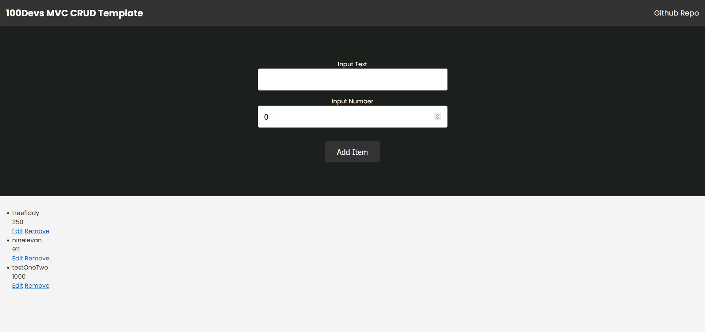

<!-- Banner Section -->

# 🛠️ MVC CRUD Template

<!--  -->

<!-- link to project -->
    <a href='-URL TO DEMO GOES HERE-'>
    <!-- link to local image -->
        
    </a>

**Link to project:** http://recruiters-love-seeing-live-demos.com/
 
 

This project is a starter template created for a **CRUD** application using the MVC architecture.  

The MVC archetecture includes the following components:

> ### Model:
> - This component is responsible for managing the data of the application. It will contain classes that represent the data objects and methods to access and manipulate them.

> ### View: 
> - This component is responsible for displaying the data to the user. It will contain HTML, CSS, and JavaScript code to render a user interface.

> ### Controller: 
> - This component is responsible for handling user input and directing it to the appropriate model or view. It will contain code that processes requests from the user, interacts with models, and renders views.

> ### Routing: 
> - This component is responsible for mapping URLs to controllers. It will contain code that maps URLs to controller actions so that requests can be routed appropriately.
 

A **CRUD** application is a type of software application that creates, reads, updates, and deletes data from a database. It stands for **Create**, **Read**, **Update**, and **Delete**. CRUD applications are used to manage data in databases such as MySQL or MongoDB. They are used to create, read, update and delete records in the database. Examples of CRUD applications include content management systems (CMS), customer relationship management (CRM) systems, and online shopping carts.

## How It's Made:
**Technologies used:** HTML, CSS, JavaScript, NodeJS, MongoDB, and Express.

  

 

> 1. Create the HTML and CSS files for the application. This will include the HTML structure and styling for the application.

> 2. Create a NodeJS server using Express to handle requests from the client side.

> 3. Connect to MongoDB and create a database for the application.

> 4. Create models for each entity in the application that will be stored in MongoDB, such as users, posts, etc.

> 5. Create routes in Express to handle requests from the client side and interact with MongoDB using models created in step 4. These routes will be used to create, read, update, and delete data from MongoDB. 

> 6. Create JavaScript files that will make AJAX requests to the routes created in step 5 and update the UI accordingly based on responses received from server-side code.
 

## Instructions

1. Open the terminal and run "npm install -y"
2. In the config" folder, create a file called ".env"
3. In .env, type 
    DB_CONNECTION = (your database connection string goes here)
    Replace <password> in the string with your password
    If you want a custom database name (recommended), add the database name between mongodb.net/ and the ? in the string. Example: mongodb.net/BasicFullStackMVC?
4. Save!
5. In the terminal, type "npm start"
6. Open the browser to http://localhost:8500/ and you should see the homepage!

<!-- 

  

 -->

<!-- &nbsp;
&nbsp;&nbsp;
&nbsp;&nbsp; -->

## Optimizations

_(optional)_

You don't have to include this section but interviewers _love_ that you can not only deliver a final product that looks great but also functions efficiently. Did you write something then refactor it later and the result was 5x faster than the original implementation? Did you cache your assets? Things that you write in this section are **GREAT** to bring up in interviews and you can use this section as reference when studying for technical interviews!

## Lessons Learned:

No matter what your experience level, being an engineer means continuously learning. Every time you build something you always have those _whoa this is awesome_ or _fuck yeah I did it!_ moments. This is where you should share those moments! Recruiters and interviewers love to see that you're self-aware and passionate about growing.

## Examples:

Take a look at these couple examples that I have in my own portfolio:

**Palettable:** https://github.com/alecortega/palettable

**Twitter Battle:** https://github.com/alecortega/twitter-battle

**Patch Panel:** https://github.com/alecortega/patch-panel

**Patch Panel:** https://github.com/alecortega/patch-panel
